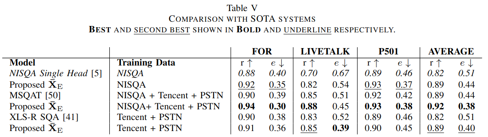

# WhiSQA: Whisper-based Speech Quality Assessment

A Python package for automated speech quality assessment using Whisper encoder features and transformer-based models.

## Features

- **Single MOS Prediction**: Get overall Mean Opinion Score (MOS) for speech quality
- **Multi-dimensional Assessment**: Evaluate speech across 5 dimensions:
  - MOS (Mean Opinion Score)
  - Noisiness
  - Coloration  
  - Discontinuity
  - Loudness
- **Batch Processing**: Efficiently process multiple audio files
- **Flexible Input**: Supports various audio formats, automatically resamples to 16kHz and converts to mono
- **Easy Integration**: Use as a Python package or command-line tool

## Installation

### Option 1: Install from source (Development)
```bash
git clone https://github.com/leto19/WhiSQA.git
cd WhiSQA
pip install -e .
```

### Option 2: Direct package installation
```bash
pip install -e git+https://github.com/leto19/WhiSQA.git#egg=whisqa
```

## Usage

### Python Package

```python
import whisqa

# Single file assessment
score = whisqa.get_score("audio.wav", model_type="single")
print(f"MOS: {score.item() * 5:.3f}")

# Multi-dimensional assessment
scores = whisqa.get_score("audio.wav", model_type="multi") 
print(f"MOS: {scores[0].item() * 5:.3f}")
print(f"Noisiness: {scores[1].item() * 5:.3f}")
print(f"Coloration: {scores[2].item() * 5:.3f}")
print(f"Discontinuity: {scores[3].item() * 5:.3f}")
print(f"Loudness: {scores[4].item() * 5:.3f}")

# Batch processing
audio_files = ["audio1.wav", "audio2.wav", "audio3.wav"]
scores = whisqa.get_score_multi(audio_files, model_type="single", batch_size=8)
```

### Command Line Interface

```bash
# Single file
whisqa --audio_file audio.wav --model_type single

# Multiple files
whisqa --audio_files *.wav --model_type multi --output_format json

# Batch processing with custom batch size
whisqa --audio_files audio1.wav audio2.wav audio3.wav --model_type single --batch_size 4

# Custom checkpoint directory
whisqa --audio_file audio.wav --checkpoint_dir ./my_checkpoints --model_type single
```

### Output Formats

The CLI supports multiple output formats:

- `human` (default): Human-readable format
- `json`: JSON format for programmatic use
- `csv`: CSV format for spreadsheet import

```bash
whisqa --audio_files *.wav --output_format json > results.json
whisqa --audio_files *.wav --output_format csv > results.csv
```

### Using from Another Directory

```python
import sys
from pathlib import Path

# Add WhiSQA to Python path
sys.path.insert(0, str(Path("path/to/WhiSQA")))

import whisqa

# Use normally
score = whisqa.get_score("my_audio.wav")
```

## Package Structure

```
WhiSQA/
├── whisqa/                     # Main package
│   ├── __init__.py            # Package initialization
│   ├── core.py                # Core functionality
│   ├── cli.py                 # Command-line interface
│   ├── checkpoints/           # Pre-trained model weights
│   │   ├── single_head_model.pt
│   │   └── multi_head_model.pt
│   └── models/                # Neural network models
│       ├── __init__.py
│       ├── whisper_ni_predictors.py  # Main predictor models
│       ├── transformer_wrapper.py   # Transformer components
│       ├── transformer_config.py    # Model configurations
│       ├── whisper_wrapper.py       # Whisper encoder wrapper
│       └── mel_filters.npz          # Mel filter banks
├── setup.py                   # Package setup
├── requirements.txt           # Dependencies
├── get_score_new.py          # Legacy CLI (backward compatibility)
└── README.md                 # This file
```

## Model Details

### Architecture
- **Feature Extractor**: Whisper encoder (frozen)
- **Layer Fusion**: Learnable weighted combination of encoder layers
- **Transformer**: 4-layer transformer with 256-dimensional embeddings
- **Pooling**: Attention-based pooling for sequence-to-scalar prediction
- **Output**: Sigmoid activation for 0-1 range (scaled to 0-5 for MOS)

### Models
- **Single-head**: Predicts overall MOS score
- **Multi-head**: Predicts 5 quality dimensions simultaneously

### Requirements
- Python 3.8+
- PyTorch 2.1.0+
- torchaudio 2.1.0+
- transformers 4.35.0+
- soundfile

## API Reference

### Core Functions

#### `get_score(audio_file, model_type="single", checkpoint_dir=None)`
Assess a single audio file.

**Parameters:**
- `audio_file` (str): Path to audio file
- `model_type` (str): "single" or "multi"
- `checkpoint_dir` (str, optional): Custom checkpoint directory

**Returns:**
- `torch.Tensor`: Quality scores (1D for single, 5D for multi)

#### `get_score_multi(audio_files, model_type="single", batch_size=16, checkpoint_dir=None)`
Assess multiple audio files in batches.

**Parameters:**
- `audio_files` (List[str]): List of audio file paths
- `model_type` (str): "single" or "multi"  
- `batch_size` (int): Batch size for processing
- `checkpoint_dir` (str, optional): Custom checkpoint directory

**Returns:**
- `torch.Tensor`: Quality scores for all files

## Legacy Support

The original `get_score.py` script is preserved as `get_score_new.py` for backward compatibility. However, we recommend using the new package interface for new projects.

### Legacy Usage
```bash
# Old way (still supported)
python3 get_score_new.py --audio_file /path/to/mono_16k_wav_file.wav

# New way (recommended)
whisqa --audio_file /path/to/any_audio_file.wav
```



## Examples

See `example_usage.py` for a complete example of using WhiSQA from an external script.

## Contributing

1. Fork the repository
2. Create a feature branch
3. Make your changes
4. Add tests if applicable
5. Submit a pull request

## License

[Add your license information here]

## Citation

If you use WhiSQA in your research, please cite:

```
[Add citation information when available]
```
